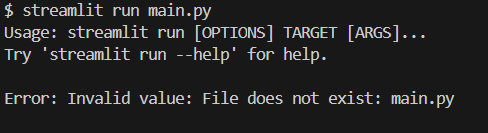

# Personalised Student DataBase
## Overview
Personalised Database is a web application that basically allow user to store the personal Details and keep track of the daily tasks to be done , and Important Remainders can be noted down.
## Brief Description
[Personalised Student Database](https://github.com/0304ajay/Personalised_Student_DataBase_for_Academics) has many functionalites some of them are, storing the **Academic Details** and **Personal details**. Further going on the **Academic Details** Section has an optionality to store complete Academic details of user's, Tenth Standard , Twelth Standard , Graduation Details , Notes ,following by the Daily Work Tracker .
Then comes the **Personal Details** section Which has optionality to store details of user driving Licence and Aadhar Details.
## Goal
The main Goal of the project is to store the important personal details at a single place which  reduces the  amount time to search and also reduce the the amount of time in filling any online forms which requires our details.
## key Features
- First Most Key feture is copying the required details on to the clipboard by just clicking on copy which copies complete details of the particular section so the user can just paste without any type.
- Then Comes storing of  **files(pdf)** this feature helps user to store the images and also downloading the respected  files.
- The next feature is the work Tracker Which keep shows us the daily streak of our work.

# Installation
- step 1 : Clone the Project or Download the Project
- step 2 : If Downloaded unzip the file
- step 3 : Open the project in the [Visual Studio code](https://code.visualstudio.com/) 
- step 4 : Open the terminal and type the command shown below (for Windows)
  ```
  pip install streamlit
  ```
- open the file **database.py** and update your user and password of your sql database in the line number 3.
- Open [MySql Work Bench](https://dev.mysql.com/downloads/mysql/) goto local instance and connect to the local server
- Go to **schemas** which is on the left side beside the administration  and click on it then right click the schemas space then select the option **create schema** and give the name as **personalised_student_database_for_academics** and then apply.
- Then if you have multiple schemas make the **personalised_student_database_for_academics** as a default schema.
- Then go to file ->open sql script File ->choose the file **Database.sql** from the project folder.
- Then once the file is opened click on execute symbol(⚡) then check the output if everything is created correctly it will not display any error.
- Then to run the file use the command
  ```
  streamlit run main.py
  ```
> [!WARNING]
  > Some times you make get error as shown in this case you just copy the relative path of the file and change the back ward slash to forward slash and try to run.



## Configuration Guide
- Replace the **name** with your Original name.
- Upload A photo into the project folder from the file explorer in system and then copy its path and the change the path of the image in the main.py file at line no 43.

## Additional Resources 
- [Streamlit Documentation](https://docs.streamlit.io/)
- [Mysql](https://dev.mysql.com/downloads/mysql/)
- [Sql Commands](https://www.w3schools.com/MySQL/default.asp)

## Support and Contact Information
- If any issuse is not resolved you can directly message me in github.
- connect with me in [Linked in](https://www.linkedin.com/in/k-ajay-kumar-reddy-b4a826216/)
